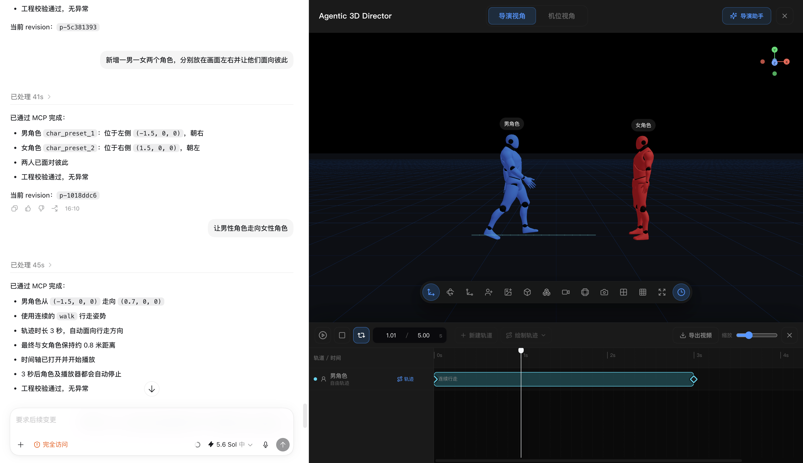
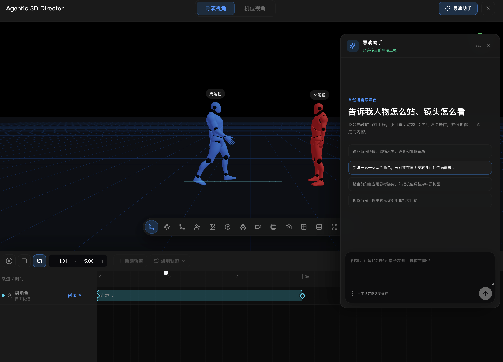

# Agentic 3D Director

> 本项目基于原始开源项目 [storyai-3d-director-desk](https://github.com/jiguang132/storyai-3d-director-desk) 进行二次开发。感谢原作者提供 3D 导演台的基础能力；本仓库重点扩展 Agent 自然语言控制、MCP 语义工具和动画制作工作流。

## 本项目新增

- 网页内置可拖拽的“导演助手”，可用自然语言操作当前导演台
- 本机 Agent 服务与 18 个 MCP 语义工具，支持 Codex 精确控制角色、道具、姿势、机位、场景和动画轨迹
- revision 乐观锁、人工对象锁定保护、执行后工程校验和多页面连接租约
- 动画时间轴、可拖拽播放头、轨道与关键帧编辑
- 直线、标准圆、矩形和自由绘制轨迹，支持角色、道具与机位
- 角色连续走路 / 跑步姿势，动作在所属轨道结束时自动停止
- 视频导出，自动以最长启用轨道的末关键帧作为有效结束时间

### 新功能截图

#### Codex + MCP 自然语言控制导演台

通过 Codex 调用 MCP 语义工具新增角色、调整位置并创建连续行走轨迹，导演台同步显示执行结果和动画时间轴。



#### 网页内导演助手与动画时间轴

网页助手可直接理解自然语言指令，配合可拖拽面板、关键帧轨道、连续步态和视频导出完成导演操作。



一个基于 React、Vite、Three.js 和 React Three Fiber 的 3D 分镜导演台。它适用于轻量级预演、镜头规划和场景摆位，支持在浏览器里搭建角色、机位、场景和全景背景，并快速记录镜头与截图结果。

## 功能概览

- 导演视角 / 机位视角切换
- 内置8种不同的人物，20种不同的人物姿势
- 角色、群演、基础几何体和机位快速添加
- 本地 FBX / OBJ 模型导入，可自定义模型库
- 群众阵列，想多少人就可以多少人
- 全景图导入与背景调节
- 机位拍摄、截图记录和基础镜头管理
- 视口比例框、九宫格、平移 / 旋转 / 缩放控制
- 动画时间轴、可拖拽播放头、角色连续走跑步态、标准圆/矩形/直线/自由轨迹和 WebM/MP4 视频导出
- 本地场景状态持久化
- 网页内自然语言“导演助手”，使用本机 Codex 读取并操作当前工程
- 18 个 MCP 语义工具，支持 Codex 通过精确 ID 操纵角色、道具、姿势、机位、场景与动画轨迹
- 工程 revision 乐观锁、人工对象锁定保护和执行后校验

## 技术栈

- React 18
- Vite 6
- TypeScript
- Three.js
- @react-three/fiber
- @react-three/drei
- Zustand
- Vitest

## 项目结构

```text
src
├─ app/layout          # 顶层壳布局，组织画布与左右侧栏
├─ editor/canvas       # Three.js / R3F 视口、画幅框、工具条、截图视图
├─ editor/timeline     # 动画时间轴、关键帧插值、轨迹绘制与视口路径
├─ editor/panels       # 左侧对象树与右侧属性面板
├─ editor/store        # Zustand 状态管理、撤销与剪贴板逻辑
├─ editor/io           # 截图导出、工程导入导出、宿主通信
├─ editor/loaders      # 本地模型与全景图导入
├─ editor/runtime      # 角色渲染、骨骼和姿势应用
├─ editor/agent        # Agent 语义命令、浏览器桥接和网页助手
├─ editor/schema       # 数据结构、机位和视口相关定义
└─ styles              # 全局样式
```

## 本地开发

```bash
npm install
npm run dev
```

如需使用网页导演助手或 Codex MCP，另开一个终端启动本机 Agent 服务：

```bash
npm run agent
```

默认开发地址通常为：

```text
http://127.0.0.1:5173/
```

如果本机端口被占用，Vite 会自动顺延到下一个可用端口。

预览生产包：

```bash
npm run preview
```

默认预览地址通常为：

```text
http://127.0.0.1:4173/
```

## 常用操作

- 顶部可切换 `导演视角` 与 `机位视角`
- 左侧用于搜索、选择、分组查看场景对象，并支持可见性 / 锁定 / 删除
- 中央视口用于摆放场景、切换变换模式、添加角色和机位、导入资源与截图
- 右侧属性面板会根据当前选中对象自动切换为场景 / 角色 / 模型 / 摄像机编辑面板

## 快捷键

- `Ctrl/Cmd + C`：复制当前选中对象
- `Ctrl/Cmd + V`：粘贴复制对象
- `Ctrl/Cmd + Z`：撤销最近一次操作
- `Delete / Backspace`：删除当前选中对象

## 数据与嵌入

- 当前场景与本地模型库会写入浏览器 `localStorage`
- 支持导出工程 JSON，也支持通过文件重新导入
- 支持“保存最近工程 / 恢复最近工程”
- 组件已包含宿主页面通信桥，适合嵌入到更大的创作工作台中
- Agent/MCP 的完整启动方式、工具列表、安全边界与宿主协议见 [Agent 与 MCP 接入指南](./docs/AGENT_INTEGRATION.md)

## 用自然语言操纵导演台

1. 运行 `npm run agent` 和 `npm run dev`。
2. 打开导演台，点击右上角“导演助手”。
3. 等待状态变为“已连接当前导演工程”，直接描述人物摆位、姿势、道具和机位要求。

项目已包含 `.codex/config.toml`。信任该项目并重启 Codex/新建任务后，也可以直接对 Codex 说：

> 先读取当前导演台。新增两个角色，让他们站在画面左右并面向彼此；把机位调成中景，保留人工锁定内容，完成后校验工程。

导演台不会让 Agent 模拟点击界面，而是暴露带输入约束的语义工具；所有修改仍走现有 Store，因此手工操作、撤销、本地持久化和相机联动保持一致。

## 构建与测试

构建：

```bash
npm run build
```

测试：

```bash
npm test
```

最近一次核对结果：

- `npm run build` 可通过
- 构建阶段会出现少量 Vite 警告：部分模型库缩略图 URL 会保留到运行时解析，同时主包体积超过默认 chunk 警告阈值
- `npm run test:agent` 为 `3 / 3` 通过，MCP 探测确认暴露 18 个语义工具
- `npm test` 当前为 `332 / 341` 用例通过；剩余 9 个失败是已有的模型库缩略图/卡片、视口布局与画幅、轴向命中区、手机姿势、场景输入样式和机位几何基线断言

## 开源说明

- 本仓库以源码演示为主，适合继续扩展为更完整的 3D 导演工具。
- 当前版本保留内置角色能力，并支持通过界面导入本地模型与全景图。
- 若你基于本项目继续发布，请自行确认新增模型、贴图和场景素材的分发许可。

## License

MIT
